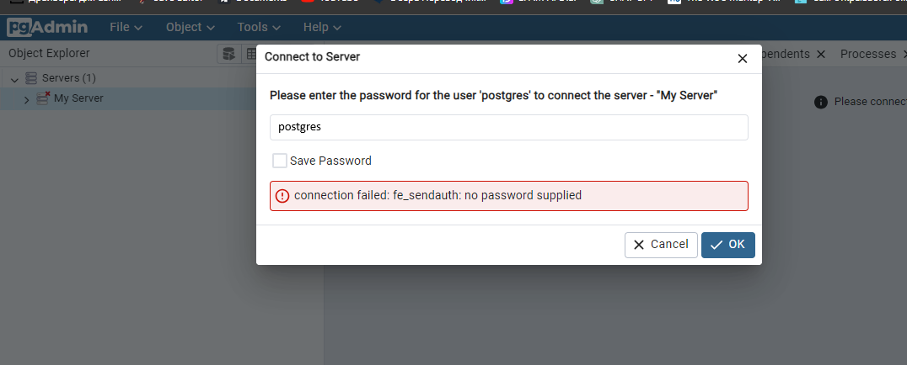

# Getting Started

### Reference Documentation

For further reference, please consider the following sections:

* [Official Apache Maven documentation](https://maven.apache.org/guides/index.html)
* [Spring Boot Maven Plugin Reference Guide](https://docs.spring.io/spring-boot/docs/3.2.2/maven-plugin/reference/html/)
* [Create an OCI image](https://docs.spring.io/spring-boot/docs/3.2.2/maven-plugin/reference/html/#build-image)

# How to run in docker:

1) Use "**mvn clean install -DskipTests**" in root folder for creating .jar
2) Use "**docker build -t myapp .**" to create image from .jar
3) Use "**docker-compose up -d**" to up containers
4) Optional: if u want to check db, use pgAdmin via this link: **http://localhost:8080/**
    - user: **pgadmin4@pgadmin.org**
    - password: **postgres**
5) Then use password to registry server:

